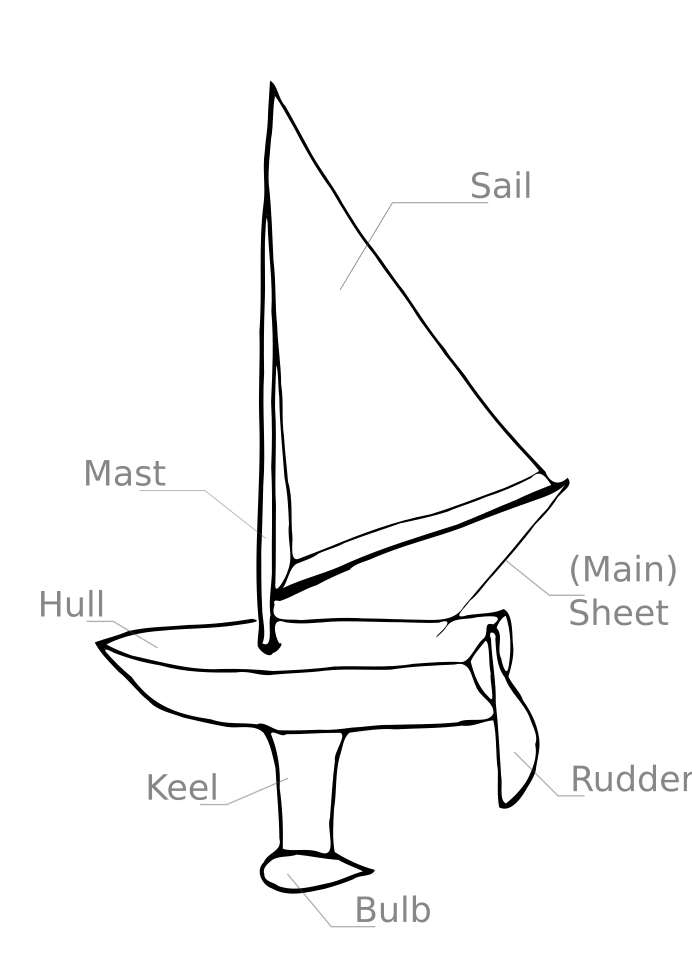

The boat
========

A standard sailing boat has four main parts:

- **Hull**: Base platform, floats in the water.
  Probably also holds most of your electronics.
- **Sails**: Transfers energy from the wind to the boat.
  Sails are most effective when acting as an airfoil,
  not just a bag catching the wind.
- **Keel**: Heavy weight underwater, stops the boat falling over.
- **Rudder**: Sticks into the water, turns to steer the boat.

If you don't want to build your own boat, a good shortcut is to look for remote
controlled model sailing boats. Complete boats with servos for the sails and the
rudder are available for a few hundred euros/dollars/pounds. The *RC laser*
is one popular model, while the *International One Metre* class is a
specification that many different models are made to.

Other things to try
-------------------

- *Wing sails* are rigid airfoils rather than a flexible sheet.
  They can be balanced so that changing and holding their position needs little
  force.
- An *air rudder* steers by deflecting air instead of water. Åland sailing
  robots use this in combination with a free rotating wing sail. (Ref paper)
- *Multi-hull* designs, like catamarans and trimarans, have two or more hulls
  side-by-side, with a gap between them. This can help make the boat more
  stable.
